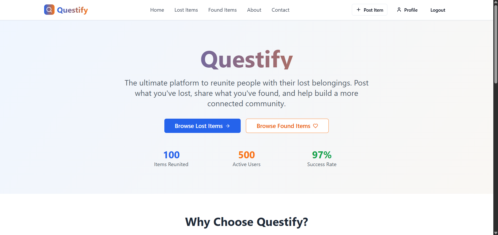

# Questify



**Questify** is a modern platform designed to help users post and discover lost and found items with ease. Whether it's a misplaced wallet or a found set of keys, **Questify** connects users who have lost items with those who have found them — making the process fast, reliable, and community-driven.

---

## Features

- 📌 **Post Lost or Found Items**  
  Share detailed descriptions and images of lost or found belongings.

- 🔍 **Explore Recent Posts**  
  View a feed of newly added lost and found listings in real-time.

- ❤️ **Like and Comment**  
  Engage with posts through upvotes (likes) and comments.

- ✉️ **Contact Post Owners**  
  Reach out directly to the person who posted a lost/found item.

- 📄 **Easy-to-Use Forms**  
  Seamless and clean interface for posting new items.

- 🧭 **Fully Responsive & Modern UI**  
  Beautiful, minimal, and user-first interface using **shadcn-ui** and **Tailwind CSS**.

---

## Tech Stack

| Layer        | Technology                          |
| ------------ | ----------------------------------- |
| Frontend     | **React**, **TypeScript**, **Vite** |
| UI Framework | **shadcn/ui**, **Tailwind CSS**     |
| Backend      | **Express.js**, **Node.js**         |
| Database     | **Supabase**                        |

---

## Upcoming Updates

We’re constantly working on adding powerful features. Here’s what’s coming soon:

- 🗑️ **Delete Posts**
- 🎁 **Reward System for Helpful Users**
- 📢 **Ad Listings for Extra Visibility**
- 🚀 **Boost Your Posts**
- 📱 **PWA & Mobile Optimization**
- 🔔 **Notification System**

---

## Project Setup

### Clone the repository:

```bash
git clone https://github.com/adityadhiman-in/questify.git
```

### Navigate to the project directory:

```
cd questify
```

### Install dependencies:

```
npm install
```

### Start the development server:

```
npm run dev
```

## Contact

Feel free to reach out if you have any questions or suggestions!

- [Website](https://adityadhiman.in)
- [GitHub](https://github.com/adityadhiman-in)
- [LinkedIn](https://www.linkedin.com/in/adityadhiman-in)

Made with ❤️ by [Aditya Dhiman](https://adityadhiman.in)
